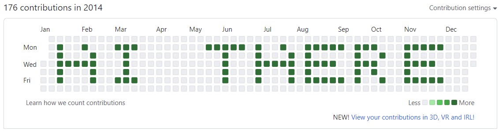

# Github Contrib Graph Writer

Write a (short) message in your github contrib graph. Looks like 

## How it works

The script converts your message to a 5x5 pixel font (Nitram Micro - see credits below) and then maps those pixels to particular dates on your github contrib history graph. It then creates nonsense git commits on days in the past so that the message shows up.

## How to use it

1. Set up git and an empty repo locally and take note of the _path_ for later. You can push this to repo github. The script will add the requied commits to this repo and when it is done you'll push the changes to github for them to show up on the contrib graph. You'll also obviously need git set up with the correct email and username so that git repos that you push to github are showing up normally in your contrib graph.

1. Decide on a message. You can fit about 8 characters into a one year contrib graph.

1. Pick the starting date for the message. This needs to be a Sunday so that it is on the top line of your contrib graph and I suggest as far left as possible. For example, in 2014 a good starting date is 2014-01-12

1. Clone this repo and install deps. I wrote this using node 16 so use that to be safe
```
> git clone https://github.com/ahoydave/contrib-graph-writer.git
> cd contrib-graph-writer
> npm install
```

5. Run the script with your target repo `path`, the `start date` in ISO format and your `message`. The `numCommitsPerDate` allows you to make your message stand out if there are other commits associated with your account.
```
> node main.js <path> <start date> <message> <num commits per date>
```
Make sure you put quotation marks around the message if there are spaces. For example it might be
```
> node main.js ~/contrib-graph-message 2014-01-12 'hi there' 1
```
You should see some git output

6. If nothing broke, push the changes to github and check your graph to see if it worked!

## Can you undo it?

Yes. You can delete the repo that has these nonsense commits and that removes the contribs from the graph.

Weirdly it seems github remembers individual commits, even if you later move them or delete them from a repo. This may be because I don't completely understand how git works of course. But if you delete the whole repo it goes away like expected :D

## Credit

Nitram Micro Font taken from https://github.com/nitram509/nitram-micro-font